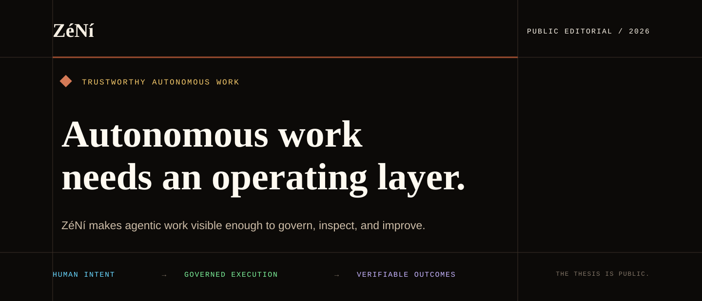

  

  <strong>The operating layer for trustworthy autonomous work.</strong> 
  Human intent in. Governed execution through. Verifiable outcomes out.

  <a href="ABOUT_ZENI.md">About</a> ·
  <a href="MANIFESTO.md">Manifesto</a> ·
  <a href="https://kelisi808.github.io/_ZeNi_/">Public brief</a> ·
  <a href="AGENTIC_WEB.md">Agentic Web</a> ·
  <a href="CAUSAL_OPERATING_SYSTEM_PROOF.md">Bounded proof</a> ·
  <a href="FAQ.md">FAQ</a>

---

## AI can produce. Can it account?

Models can answer prompts. Agents can call tools. The harder problem begins
when autonomous work crosses models, agents, systems, budgets, and approval
boundaries.

Who was allowed to act? Why was that route chosen? What happened when the work
failed? What evidence remains? What, if anything, should the system learn?

ZéNí is building the coordination and trust layer that makes those questions
part of the work itself.

> A mission should not disappear into an agent run and return as a mysterious
> answer. It should leave a visible chain of intent, decisions, outcomes, and
> evidence.

## One system. Three operating surfaces.

| | What it makes legible |
|---|---|
| **PitStop** | The human command surface: describe missions, review state, intervene, evaluate artifacts, and export results. |
| **SideQuest** | The machine coordination layer: discover capabilities, route work, govern temporary skill access, and retain outcomes and receipts. |
| **ZéNí** | The trust fabric across both: governance, evidence standards, readiness, continuity, and learning boundaries. |

PitStop faces the human. SideQuest faces the machine. ZéNí keeps the operating
doctrine coherent between them.

## The loop is the product.

| Phase | What becomes visible |
|---|---|
| **01 · Describe** | The mission, constraints, and desired outcome. |
| **02 · Route** | Agents, models, skills, tools, and policy paths. |
| **03 · Execute** | Current state, bounded authority, and truthful exceptions. |
| **04 · Review** | Human judgment, requested artifacts, and intervention. |
| **05 · Evidence** | Receipts, outcomes, and provenance. |
| **06 · Learn** | Controlled comparison—never silent drift. |

The goal is not autonomy at any cost. It is **governable, composable
intelligence**: work that can be supervised while it happens, reconstructed
after it ends, and improved only when the evidence supports improvement.

## What is true now

**Live:** PitStop, SideQuest, and the ZéNí trust surface are deployed as a
connected pilot-readiness system. Public surfaces are intentionally narrow; the core
product repositories remain private.

**Demonstrated:** Mission Twin has retained completed missions as replayable
evidence, run a controlled route challenger, compared the result with a later
mission, and withheld promotion when the apparent lesson did not repeat. Read
the bounded account: **[The system said no](CAUSAL_OPERATING_SYSTEM_PROOF.md)**.

**In pilot readiness:** The current focus is the experience real startup
operators encounter first—mission clarity, truthful status, useful artifacts,
revision recovery, evidence, and responsive behavior.

**Not claimed:** ZéNí is not generally available, has not demonstrated a
validated causal policy, and does not treat one replay or a small pilot sample
as authority to change routing or memory automatically.

## Inspect the public proof surface

- [PitStop operator console](https://ps-cockpit-jtbcd9.fly.dev/)
- [SideQuest routing surface](https://sq-route-jtbcd9.fly.dev/)
- [ZéNí trust surface](https://zn-hub-jtbcd9.fly.dev/)
- [Human-readable pipeline sample](https://zn-hub-jtbcd9.fly.dev/public/pipeline-sample.html)
- [Machine-readable pipeline sample](https://zn-hub-jtbcd9.fly.dev/public/pipeline-sample.json)
- [Public Mission Twin maturity summary](https://sq-route-jtbcd9.fly.dev/mission-twins/public-summary)

These surfaces show bounded product and evidence behavior. They do not expose
private source, credentials, customer material, prompts, or internal production
records.

## Choose a reading path

| If you have… | Start here | Then read |
|---|---|---|
| **3 minutes** | [About ZéNí](ABOUT_ZENI.md) | [FAQ](FAQ.md) |
| **10 minutes** | [Manifesto](MANIFESTO.md) | [Why ZéNí, why now](WHY_ZENI.md) |
| **20 minutes** | [Agentic AI](AGENTIC_AI.md) | [The Agentic Web](AGENTIC_WEB.md) → [Why MCP matters](WHY_MCP_MATTERS.md) |
| **Evidence first** | [The system said no](CAUSAL_OPERATING_SYSTEM_PROOF.md) | [Trust and Governance](TRUST_AND_GOVERNANCE.md) |

Prefer a visual overview? Open the browser-readable
**[ZéNí public editorial brief](https://kelisi808.github.io/_ZeNi_/)**.

For the complete map, see [Repository Structure](REPO_STRUCTURE.md).

## Read in your language

The repository includes extensive summaries that stand on their own:

[中文（简体）](Language%20Options/SUMMARY.zh-CN.md) ·
[Français](Language%20Options/SUMMARY.fr.md) ·
[Español](Language%20Options/SUMMARY.es.md) ·
[Deutsch](Language%20Options/SUMMARY.de.md) ·
[Dansk](Language%20Options/SUMMARY.da.md) ·
[Ελληνικά](Language%20Options/SUMMARY.el.md)

---

  <strong>The thesis is public. The work is operational.</strong> 
  Founded by Kelisi Ananke · Cambridge, Massachusetts · 2026 
  <a href="https://www.linkedin.com/in/kelisi/">Engage with the venture</a>

This is ZéNí's public editorial repository, not its product source tree.
See the <a href="PUBLIC_REPOSITORY_NOTE.md">Public Repository Note</a> and
<a href="LICENSE">license</a>.
